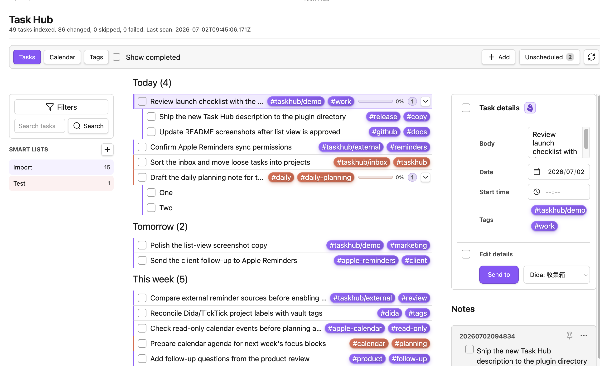
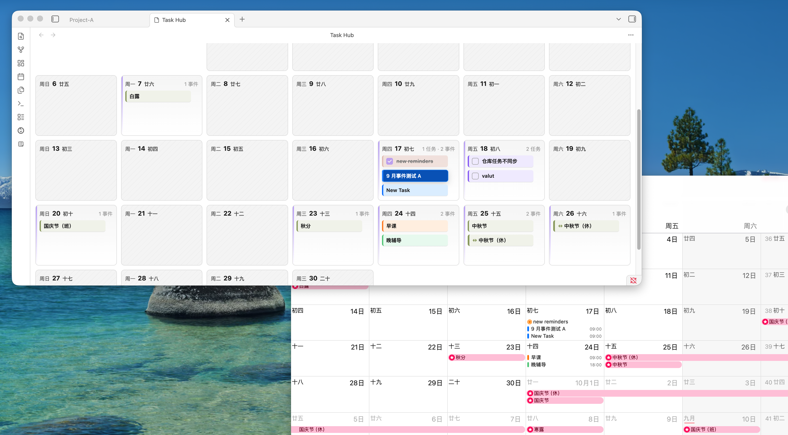

# Task Hub

[English](README.md) | [简体中文](README.zh-CN.md) | [日本語](README.ja.md) | [한국어](README.ko.md) | [Français](README.fr.md) | [Español](README.es.md)

Task Hub 是一个仅支持 Obsidian 桌面端的任务聚合插件。它把 vault 里的 Markdown 任务、Apple Reminders、Apple Calendar 事件、公共 ICS 日历和滴答清单 / TickTick 任务集中到一个工作台中。

它适合那些把任务写在日记、会议记录、项目笔记和资料笔记里，但仍然希望有一个统一入口来回顾、筛选、改期和安全更新任务的人。

## 为什么需要 Task Hub？

Task Hub 让任务继续留在原来的 Markdown 笔记里，同时提供一个专门的任务工作台。你不需要先把所有任务迁移到单独的任务管理软件，才能知道哪些事情快到期、来自哪个文件、属于哪个标签。

适合这些场景：

- 集中查看 vault 中的 `- [ ]` 和 `- [x]` 任务。
- 从任务打开源笔记，并定位到原任务行附近。
- 按列表、日历或标签回顾任务。
- 把带日期的任务和支持的提醒/日历来源放在一起看。
- 让外部来源写回保持显式开启、可控。

## 功能亮点

- 扫描 Markdown 任务：`- [ ]` 和 `- [x]`。
- 识别日期：`📅 YYYY-MM-DD`、`due:: YYYY-MM-DD` 或裸写的 `YYYY-MM-DD`。
- 按完成状态、来源、标签、日期分组、文本和自定义且/或条件筛选。
- 写回完成状态前确认源行仍匹配，避免改错行。
- 支持常见循环任务：每天、每周、每月、每年。
- 按月、周、日查看有日期的任务和日历事件。
- 对已有支持日期标记的 Markdown 任务，可在日历中拖动改期。
- 支持只读公共 ICS 日历。
- 在 macOS 上通过本地 helper 读取 Apple Reminders 和 Apple Calendar。
- 配置后可通过 Open API 同步滴答清单 / TickTick 任务。
- 可为任务和日历事件创建本地 Markdown 关联笔记。
- 插件界面支持英文、中文、日语、韩语和法语。

## 支持的来源

| 来源 | 读取 | 可选写回 | 说明 |
| --- | --- | --- | --- |
| vault Markdown 任务 | 支持 | 对支持的任务行完成、编辑、删除、循环和拖动改期 | Markdown 写回前会检查源行。 |
| 公共 ICS 日历 | 支持 | 不支持 | ICS 事件只读。 |
| Apple Reminders | macOS 14 Sonoma 或更新版本 | 开启后支持完成、重新打开、编辑、从 Markdown 创建和改期 | 通过本地 Apple helper 和 macOS 权限运行。 |
| Apple Calendar | macOS 14 Sonoma 或更新版本 | 开启后支持创建、编辑和拖动改期 | 尊重可写日历；只读日历保持只读。 |
| 滴答清单 / TickTick | 通过 Open API 支持 | 开启后支持创建、编辑、完成、删除、标签同步和拖动改期 | 需要配置 API 口令和相关设置。 |

写回能力在设置中分开控制。能读取某个来源，不代表 Task Hub 会自动修改它。

## 兼容性

- **Obsidian：** `manifest.json` 当前声明的 `minAppVersion` 是 `1.7.2`。请使用 Obsidian 桌面端 1.7.2 或更新版本。
- **移动端：** 暂不支持 Obsidian 移动端。
- **macOS Apple 集成：** Apple Reminders 和 Apple Calendar 集成仅支持 macOS。当前已测试并支持的版本范围是 macOS 14 Sonoma 或更新版本；macOS 13 或更早版本不在当前支持矩阵内。
- **其他桌面系统：** vault 任务、标签、日历、公共 ICS 和滴答清单 / TickTick 核心功能面向 Obsidian 桌面端；Apple Reminders 和 Apple Calendar 在非 macOS 系统上不可用。

## 安装

当 Task Hub 可在 Obsidian 社区插件市场安装时，可从 **设置 -> 第三方插件 -> 浏览** 中搜索安装。

从 GitHub Release 手动安装：

1. 下载 release 中的 `manifest.json`、`main.js` 和 `styles.css`。
2. 在 vault 中创建目录：`.obsidian/plugins/task-hub/`。
3. 把下载的文件复制到该目录。
4. 重启 Obsidian 或重新加载第三方插件，然后启用 **Task Hub**。

本地 Apple Reminders 和 Apple Calendar 支持依赖插件包或源码构建路径中的 `taskhub-apple-helper` 二进制文件。标准社区插件 release 附件仍然保持为 Obsidian 支持的 `manifest.json`、`main.js` 和 `styles.css`。

## 日常使用

启用后，可以通过左侧 ribbon 图标或命令面板中的 **Open Task Hub** 打开工作台。

任务视图会把 vault 任务和支持的外部任务来源集中显示。左侧栏可按来源或标签筛选；顶部工具栏可显示已完成任务、打开条件筛选、按文本搜索，或重新扫描 vault。

日历视图会合并有日期的 Markdown 任务、公共 ICS 事件、Apple Calendar 事件、Apple Reminders 和可用的滴答清单 / TickTick 任务。月、周、日布局适合不同规划粒度。拖动改期只对支持写回且已开启对应设置的来源可用。

标签视图会按 Obsidian 风格标签聚合任务，方便查看项目、场景或等待清单。

任务笔记是可选的本地 Markdown 文件，可以关联到 Task Hub 中的任务或日历事件，并通过 YAML frontmatter 保持关联关系可见、可迁移。

## 隐私和权限

Task Hub 会在本地扫描当前 vault 的 Markdown 文件，并把插件设置保存在 vault 的 Obsidian 插件数据中。

公共 ICS 只会访问你手动配置的 URL。滴答清单 / TickTick 集成只会在你启用后向配置的 API 地址发送已认证 HTTPS 请求。

本地 Apple 集成仅在 macOS 桌面端运行，并会先通过 macOS 权限系统请求提醒事项或日历访问权限。Task Hub 不会索要 Apple ID 密码，也不会直接连接 iCloud 服务器；iCloud 同步仍由 macOS 处理。

Obsidian 可能显示能力警告。Task Hub 使用这些能力的范围如下：

- **枚举 vault 文件：** 扫描 Markdown 文件中的任务行和日期标记。
- **读取/写入 vault：** 读取笔记用于索引；只有在你完成、编辑、删除或改期支持的任务时才写回。
- **文件系统访问：** 检查和使用插件路径中的可选本地 Apple helper。
- **执行 shell 命令：** 只用于启动随插件提供或本地构建的 `taskhub-apple-helper`。
- **网络请求：** 只用于获取你配置的 ICS 地址，以及启用后访问配置的滴答清单 / TickTick API。

除非你通过已配置的外部集成显式创建或同步外部任务，否则 Task Hub 不会把 vault 任务发送到远程服务。

## 当前边界

Task Hub 仍然保持保守范围：

- 暂不支持 Obsidian 移动端。
- 暂不支持 Obsidian Tasks 插件完整语法。
- 暂不支持 Markdown 任务自身的具体开始/结束时间语法。
- 暂不支持 Google Calendar OAuth 和 Microsoft Calendar OAuth。
- 公共 ICS 事件只读。
- Apple Reminders、Apple Calendar 和滴答清单 / TickTick 写回功能都需要显式开启。
- Apple helper 通过插件包或源码构建路径提供；不要假设标准社区插件 release 会额外安装 helper 附件。

## 开发

开发和发布命令以英文 README 为准：[Development](README.md#development)。

## Release 附件

Obsidian 社区插件 release 的 GitHub tag 必须和 `manifest.json` 中的 `version` 完全一致，并上传这些附件：

- `main.js`
- `manifest.json`
- `styles.css`

仓库根目录还保留 Obsidian 提交流程需要的文件：

- `README.md`
- `LICENSE`
- `manifest.json`
- `versions.json`

不要把 `taskhub-apple-helper` 等额外文件作为社区插件 GitHub Release 附件上传。Obsidian 只会从 release assets 下载 `main.js`、`manifest.json` 和 `styles.css`。
